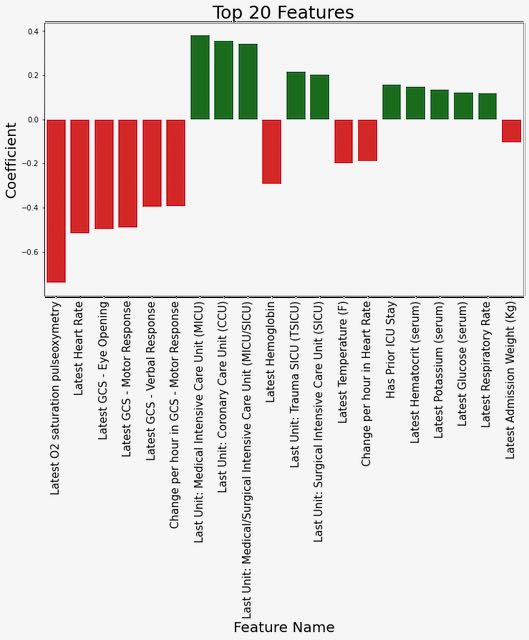
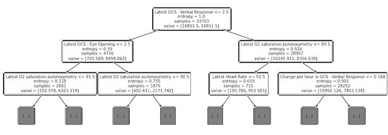
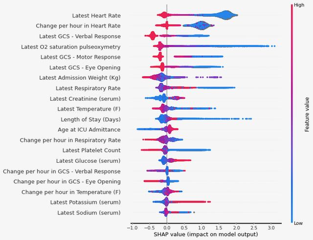

## Overview

Intensive Care Unit (ICU) readmissions cause serious problems for hospitals, patients, and insurers. For patients, readmissions not only lead to longer hospital stays, but also a clinically studied increase in mortality. For insurers and hospitals, readmissions lead to higher healthcare costs and significant reimbursement penalties. While recent research has outlined novel AI/ML recommendation systems, many avenues remain unexplored as the availability of big data in the healthcare field continues to expand. Our capstone group seeks to use various machine learning techniques to create a model that can accurately predict which ICU patients are at risk of having negative outcomes (including readmission and death). This model seeks to differentiate from existing research in the field by:

a)  Focusing on building more interpretable models in order to help providers understand why a patient was flagged for risk of readmission or death

b)  Seeking to understand the transferability of different approaches using cross validation from two of the most prominent datasets available today

## Problem
One in ten patients who are discharged from an ICU will be readmitted in 60 days or less. These patients, once readmitted, display a 6x higher hospital mortality rate and cost over $15,200 per readmission. Under the Affordable Care Act (ACA), healthcare systems can be penalized up to 3% of stay income by Medicare and Medicaid for readmissions. These penalties are most often levied the most on under-resourced, rural hospital systems. 

Most healthcare providers today rely upon clinician intuition, a variety of hospital policies, and general availability to guide ICU discharge decisions, A machine learning-based approach could help augment today’s intuition-based or one-size-fits-all approaches by flagging not only patients at risk for readmission, but showing with lab, chart, or demographic features led to the initial warning. 

## Datasets
Our approach uses two datasets, the first is the MIMIC-IV dataset taken from a range of critical care units at Beth Israel Deaconess Hospital in Boston from 2008 - 2019. This dataset contains approximately 380,000 patients and 520,000 stays and includes information such as demographics, lab measurements, medications and vital signs. 

The second dataset is the eICU dataset from the eICU Collaborative Research Database. This dataset provides data from critical care units at over 200 hospitals across the continental U.S from 2014-2015 for approximately 140,000 patients and 200,000 stays and likewise includes information such as demographics, lab measurements, medications and vital signs. 

### Features
Both the eICU dataset and the MIMIC-IV dataset contained 48 and 75 features respectively. As such, the team needed to determine how to first augment but also eventually limit feature selection in order to provide the most calibrated, yet interpretable model for future production. 

Lab or chart related data, the team provided two measurements for the machine learning models. First the team used the last taken value of the lab or chart. It then used affiliated length of stay and timestamp related data to calculate the rate of change for that feature throughout the patient stay. This essentially doubled the number of lab and chart features in the dataset. 

Literature review and previous work that consulted creditable clinician was helpful in determining what features to select for our models. Both of our datasets included many variables/features. Those features were a mix of demographics, stay characteristics, and lab measurements data. Below exhibits some of the features used: 
Demographics: age, gender, ethnicity, marital status, insurance type
Stay characteristics: length of stay, has prior stay, care unit
Clinical measurements: Last value: heart rate, respiratory rate, O2 saturation, GCS (eye, motor verbal), temperature, sodium, potassium, creatinine, hematocrit, glucose, hemoglobin, platelet count, admission weight

We also attempted modeling on a dataset that included every variable, including both the last value and rate of stay for each lab and chart value. This created a dataframe of 1,433 features. While the team was able to have a broader understanding of feature importance from these all-inclusive models, model AUC performance suffered due to general overfitting and noise. We also wanted to maintain explainability in our model and therefore avoided dimensionality reduction techniques such as PCA and CA in future models. 

### Outcomes
1) 60-Day Readmission or In-Hospital Death
The first outcome variable considered during data prep was 60-day readmission or in-hospital death. The 60-day readmission or death outcome determined for the MIMIC dataset was reasonable after consulting with ICU care teams. This variable was calculated by taking relative times between different ICU stays for the same patient. Below are some of the considerations when creating this outcome variable:
Death is a negative outcome that competes with the risk of readmission; i.e. if someone dies in the hospital then they can’t be readmitted
Limited observability of death means we can only include in-hospital death. As such, a recorded death was included in our target variable.
Timing of readmission is defined from the end of the prior ICU stay to the beginning of the next ICU stay.

2) 48-Hour Readmission or In-Hospital Death (with observability requirement)
Due to the limitations with the eICU dataset, a 48-hour readmission/death outcome was also used as a target variable for all our models and all our datasets. The eICU dataset only tracked single admission stays and does not allow for tracking patients longer than 48 hours.  Using the 48-hour death/readmission outcome allowed for restricting the MIMIC data to match the eICU data design, design our model to predict the same target variable and allow us to produce comparable results. Below are consideration when creating this outcome variable:
Aligns with what is possible using eICU data
Only includes observations from patients who remained in the same hospital after discharge from the ICU (or who were dead on discharge from ICU) 

## Modeling
Once we had identified the variables of interest, we prepared the data for our machine learning models by filling in missing values in categorical variables with ‘unknown’ and using simple imputation with the median to fill in missing values of numeric variables, utilizing the SKLearn package for Python.

We experimented with a variety of different machine learning algorithms, including logistic regression, decision trees, random forests, gradient boost, XGBoost, CatBoost, and TabNet. After hyperparameter tuning, we selected XGBoost as our consistently highest-performing model. 

## Results

XGBoost was consistently a top-performing approach across all datasets and outcomes that we examined. For the 48-hour outcome, the AUC was in the high 80’s or low 90’s for both datasets, which would help encourage trust in the model’s predictions if deployed in an ICU to help decide which patients are highest priority for additional examination and care prior to discharge. 

There was a notable performance difference between the 60-day outcome and the 48-hour outcome used for the MIMIC dataset, with all models performing much better using the 48-hour outcome. This is likely due to a combination of factors, including more immediate correspondence between clinical measurements and the negative outcome due to the short time window as well as a reduction in misclassification due to requiring observability during the 48-hour window. For example, using the 60-day outcome, there may have been patients who did die within 60 days of discharge from the ICU, but if it did not occur in this hospital, then it is not observable in this dataset and therefore not recorded as an outcome. This may be driving down the results of the model if it is accurately picking up on similarities between these patients and patients who do have observable outcomes.

Table 1: Results from training and predicting outcomes using the MIMIC-IV dataset on two different outcomes: (1) ICU readmission or in-hospital death within 60 days of ICU discharge, and (2) ICU readmission or in-hospital death within 48 hours of ICU discharge among patients remaining in the hospital (i.e. discharged from the ICU to the floor or other stepdown unit). 

| Model               |  Outcome 1: 60 Days (AUC) | Outcome 2: 48 Hours (AUC)|
| :---------------    | :---------------          | :---------------         |
| Logistic Regression | 67.8                      | 84.0 |
| Decision Tree       | 66.0                      | 83.9 |
| XGBoost             | 73.1                      | 91.8 |

Table 2: Results from training and predicting outcomes using the eICU dataset on outcome 2: ICU readmission or in-hospital death within 48 hours of ICU discharge among patients remaining in the hospital (i.e. discharged from the ICU to the floor or other stepdown unit). 

| Model               |  Outcome 2: 48 Hours (AUC)|
| :--------------     | :---------------          | 
| Logistic Regression | 87.7 |
| Decision Tree       | 87.2 |
| XGBoost             | 94.4 |

Lastly, we created a model using MIMIC-IV data as the test set and eICU data as the training set in order to test the generalizability of these models on other data. The feature-set was reduced to 48 in order to match the MIMIC features with similar features in the eICU dataset. The charts below depict the AUC scores from these cross datasets and their affiliated differences between each of the previous models. The cross dataset has a noticeable decline in AUC score, however it is still high. This shows that models are generally transferable between datasets. 

Table 3: Results from training using the MIMIC dataset and predicting outcomes using the eICU dataset on outcome 2: ICU readmission or in-hospital death within 48 hours of ICU discharge among patients remaining in the hospital (i.e. discharged from the ICU to the floor or other stepdown unit). 

| Model               |  Outcome 2: 48 Hours (AUC)|
| :--------------     | :---------------          | 
| Logistic Regression | 77.6 |
| Decision Tree       | 80.5 |
| XGBoost             | 85.0 |

### Interpretability

We explored several different approaches to highlighting which features were most influential in predicting an outcome of readmission or death, focusing on the model trained using MIMIC data to predict the 48-hour outcome since this was our primary generalizable model. First, we examined the coefficients for the top features from the logistic regression model (see Figure 1). From this, we can observe that lower values of O2 saturation, heart rate, and the Glasgow Coma Score response variables are associated with an increased risk of outcome. 

Figure 1: Coefficient weights from the logistic regression model trained on MIMIC data to predict the 48-hour outcome.

Next, we examined the split points for the first several levels of the trained decision tree model (see Figure 2).. Although this is not directly analogous to examining the coefficients with high magnitude for the logistic regression model, we did note that some of the same variables (O2 saturation, heart rate, and GCS scores)  are used for early splits in the decision tree. 

Figure 2: Decision tree plot showing top three levels of tree trained on MIMIC data to predict the 48-hour outcome.

Finally, we used [Shapley values](https://shap.readthedocs.io/en/latest/example_notebooks/overviews/An%20introduction%20to%20explainable%20AI%20with%20Shapley%20values.html) to investigate which variables are contributing most to the final predictions from our XGBoost model (see Figure 3). We again see some consistency in the top variables appearing here, with both the last recorded value of heart rate during the ICU stay and the rate of change in heart rate over the course of the stay having high predictive value (low values for either of these are correlated with an increased risk of the outcome). 

Figure 3: Summary of Shapley values for the XGBoost model trained on MIMIC data to predict the 48-hour outcome.

## Discussion

It is important to note that features identified as useful for predicting the outcome in our machine learning models are not necessarily causally related to the outcome. It is outside the scope of this type of work to make clinical recommendations for treatment of patients; rather, we are simply identifying indicators of potential high-risk patients with the goal of helping healthcare professionals prioritize care in an effective manner. 

## Supporting Slides
Note: the slide deck is only accessible to those logged in to Google with a UC Berkeley account.

[Google Slides - Final Presentation](https://docs.google.com/presentation/d/1zNuIRwdBwT33wzVQZBsBXjrRoxMhzQjeOeQEm_L4jbY/edit)

## Citations
1. Johnson, A., Bulgarelli, L., Pollard, T., Horng, S., Celi, L. A., & Mark, R. (2021). MIMIC-IV (version 1.0). PhysioNet. <https://doi.org/10.13026/s6n6-xd98>.
2. Pollard, T., Johnson, A., Raffa, J., Celi, L. A., Badawi, O., & Mark, R. (2019). eICU Collaborative Research Database (version 2.0). PhysioNet. <https://doi.org/10.13026/C2WM1R>.

## About Us
This website is the final deliverable for our capstone project as part of the course W210: Synthetic Capstone in the UC Berkeley Master of Information and Data Science (MIDS) program. We took the course in the spring of 2022 with Puya Vahabi and Alberto Todeschini. More information about us is below.

Dahler Battle 
[[Linked-in]](https://www.linkedin.com/in/dahlerbattle/)
[[Github]](https://github.com/dahlerbattle)

Mohamed Gesalla 
[[Linked-in]](https://www.linkedin.com/in/mohamed-gesalla/)
[[Github]](https://github.com/mgesalla) 

Natasha Flowers
[[Linked-in]](https://www.linkedin.com/in/natasha-a-flowers/)
[[Github]](https://github.com/natasha-flowers)

