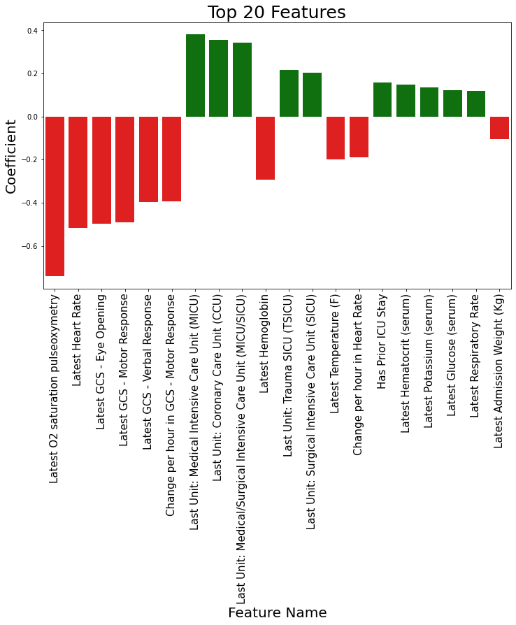
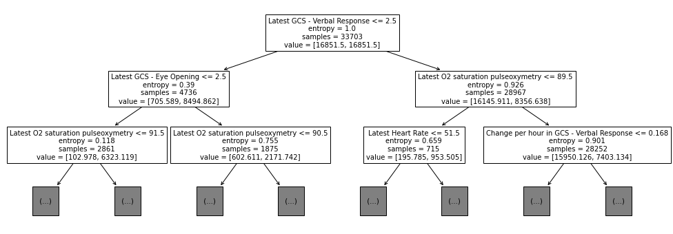
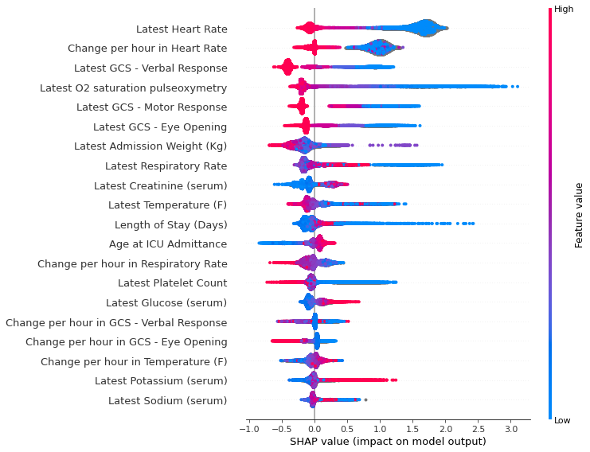

# Generalizable Predictions of ICU Readmissions & Deaths Using Machine Learning


## Overview


## Problem


## Datasets
### MIMIC-IV

### eICU

### Outcomes
  - 60-Day Readmission or In-Hospital Death
  - 48-Hour Readmission or In-Hospital Death (with observability requirement)

### Features
  - Latest value
  - Change over stay


## Modeling


## Results
Table 1: Results from training and predicting outcomes using the MIMIC-IV dataset on two different outcomes: (1) ICU readmission or in-hospital death within 60 days of ICU discharge, and (2) ICU readmission or in-hospital death within 48 hours of ICU discharge among patients remaining in the hospital (i.e. discharged from the ICU to the floor or other stepdown unit). 

| Model           |  Outcome 1: 60 Days (AUC) | Outcome 2: 48 Hours (AUC)|
| :--------------- | :---------------     | :---------------     |
| Logistic Regression | 67.8 | 84.0 |
| Decision Tree | 66.0 | 83.9 |
| XGBoost | 73.1 | 91.8 |

### Interpretability
Figure 1: Coefficient weights from the logistic regression model trained on MIMIC data to predict the 48-hour outcome.


Figure 2: Decision tree plot showing top three levels of tree trained on MIMIC data to predict the 48-hour outcome.


Figure 3: Summary of Shapley values for the XGBoost model trained on MIMIC data to predict the 48-hour outcome.


## Discussion

## Supporting Slides
https://docs.google.com/presentation/d/1zNuIRwdBwT33wzVQZBsBXjrRoxMhzQjeOeQEm_L4jbY/edit


## About Us


Markdown is a lightweight and easy-to-use syntax for styling your writing. It includes conventions for

```markdown
Syntax highlighted code block

# Header 1
## Header 2
### Header 3

- Bulleted
- List

1. Numbered
2. List

**Bold** and _Italic_ and `Code` text

[Link](url) and 
```

For more details see [Basic writing and formatting syntax](https://docs.github.com/en/github/writing-on-github/getting-started-with-writing-and-formatting-on-github/basic-writing-and-formatting-syntax).

### Jekyll Themes

Your Pages site will use the layout and styles from the Jekyll theme you have selected in your [repository settings](https://github.com/dahlerbattle/w210_capstone/settings/pages). The name of this theme is saved in the Jekyll `_config.yml` configuration file.

### Support or Contact

Having trouble with Pages? Check out our [documentation](https://docs.github.com/categories/github-pages-basics/) or [contact support](https://support.github.com/contact) and we’ll help you sort it out.

